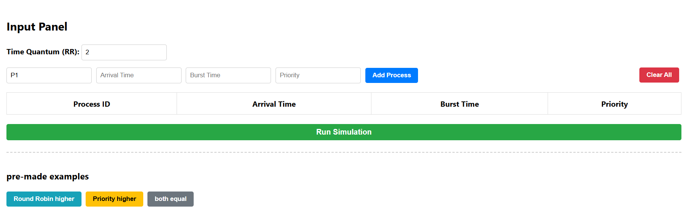
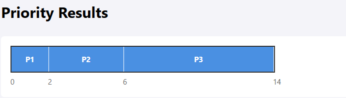
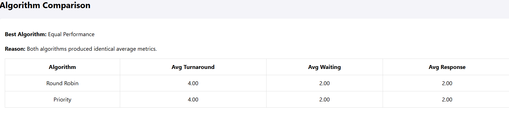

# CPU Scheduling Simulator
#### Overview

- This project is a web-based CPU Scheduling Simulator that visually demonstrates and compares two scheduling algorithms:
  - Round Robin (RR)
  - Priority Scheduling (Non-preemptive)

- It allows users to input processes, simulate execution, visualize Gantt charts, and compare performance using standard scheduling metrics.

#### Features
1. Add custom processes (ID, Arrival Time, Burst Time, Priority)
2. Adjustable Time Quantum for Round Robin
3. Visual Gantt chart for both algorithms
4. Automatic calculation of:
5. Average Turnaround Time
6. Average Waiting Time
7. Average Response Time
8. Built-in comparison system to determine the better algorithm
9. Pre-made test cases for quick evaluation
10. Algorithms Implemented
---
#### 1.Round Robin Scheduling

- Each process receives CPU time in fixed time slices (quantum)
- Processes are cycled through a ready queue
- Ensures fairness among all processes

#### 2.Priority Scheduling (Non-preemptive)

- Processes are executed based on priority value
- Lower numerical value = higher priority
- Once a process starts, it runs until completion
- Comparison Logic

#### 3.Comparison

| Aspect                           | Round Robin (RR)                                                                                                                   | Priority Scheduling (Non-preemptive)                                                                                                          |
| -------------------------------- | ---------------------------------------------------------------------------------------------------------------------------------- | --------------------------------------------------------------------------------------------------------------------------------------------- |
| **Fairness**                     | High fairness because each process receives equal CPU time through fixed time slices. No single process can monopolize the CPU.    | Lower fairness because CPU allocation depends entirely on priority values. Low-priority processes may wait significantly longer.              |
| **Urgency Handling**             | Handles all processes equally, regardless of urgency or importance. Critical tasks are not prioritized.                            | Excellent for urgent or critical tasks since higher-priority processes execute first. Suitable for real-time or priority-sensitive workloads. |
| **Starvation Risk**              | Very low starvation risk because all ready processes eventually receive CPU time.                                                  | High starvation risk for low-priority processes if higher-priority tasks continue arriving.                                                   |
| **Aggregation / System Balance** | Provides balanced resource distribution and smoother overall responsiveness across processes. Works well for time-sharing systems. | Optimizes execution for important tasks but may create imbalance by heavily favoring high-priority processes.                                 |
| **Response Time**                | Typically better response time for interactive systems because processes receive CPU access quickly.                               | Response time depends on priority level; high-priority tasks respond quickly while lower-priority tasks may experience delays.                |
| **CPU Utilization Behavior**     | Frequent context switching can increase overhead in real operating systems.                                                        | Lower switching overhead because processes run until completion once selected.                                                                |
| **Best Use Case**                | Multi-user or interactive systems where fairness and responsiveness are important.                                                 | Systems requiring urgent task execution or differentiated process importance.                                                                 |

---
#### The system evaluates both algorithms using a simple scoring method:

- $Score = Avg Turnaround Time + Avg Waiting Time + Avg Response Time$
- The algorithm with the lower score is considered better for the current dataset.

#### Assumptions
- All processes are independent and fully CPU-bound
- No I/O blocking or interruptions
- Priority Scheduling is non-preemptive
- Lower priority number means higher priority
- Context switching cost is ignored
- Arrival times are valid integers ≥ 0
- Burst times are positive integers

#### Limitations
- Does not simulate real OS context switching overhead
- No aging mechanism in Priority Scheduling (may cause starvation)
- Round Robin assumes constant quantum for all processes
- Does not support multi-core CPU scheduling
- No I/O burst simulation (CPU-only model)
- Limited scalability for very large process sets due to DOM-based rendering

#### Screenshots
Input Panel

Round Robin Gantt Chart

Priority Scheduling Gantt Chart

Comparison Result

Example Output Interpretation
If Round Robin performs better:
Workloads are likely balanced and fairness improves responsiveness
If Priority Scheduling performs better:
System favors short or high-priority tasks
If equal:
Both algorithms perform similarly under given workload distribution
Technical Notes
Implemented using Vanilla JavaScript (ES6)
No external libraries used
DOM-based dynamic rendering for Gantt charts
Metric calculations derived from execution trace logs
Modular function-based architecture for scheduling logic
